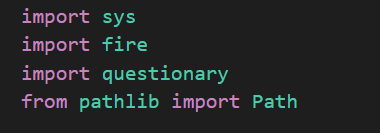
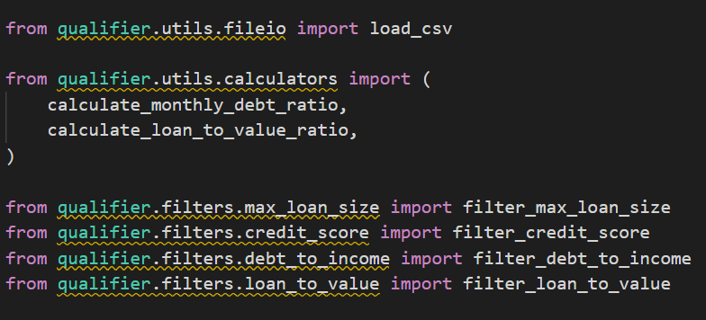
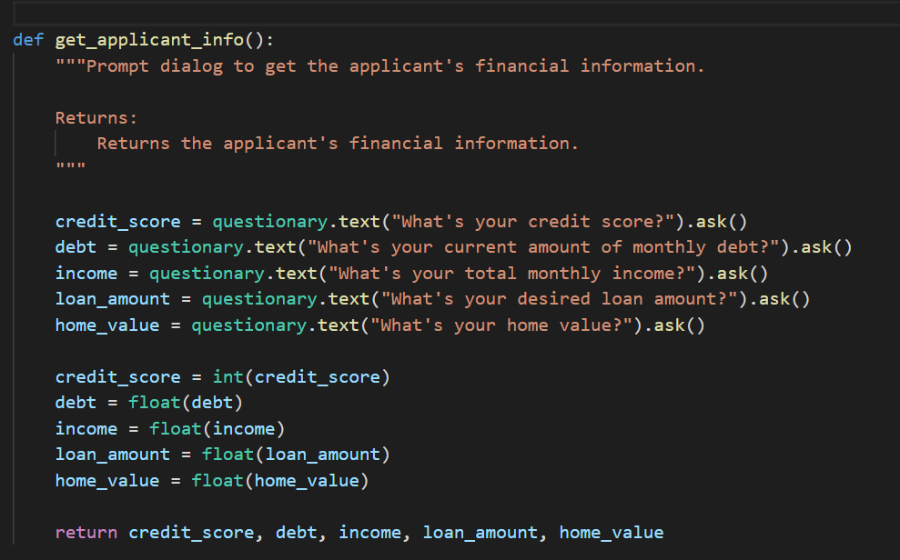

# Loan Qualifier Application


This is a command line interface (CLI) data processing application for bank loan pre-qualification screening. This application matches loan applicants with banks and associated bank loans for which they may qualify.

The screening application is processed via applicant query for applicant specific data. The user will input applicant's credit score, current debt level, income, the size of the loan desired, and the value of the applicant's collateral (i.e. current home value). These data points are compared against the loan criteria of various lenders contained within a comma separated values (CSV) file, 
```daily_rate_sheet.```

Through processing the loan applicant provided data and comparing it to the loan criteria of various lenders, the loan applicant's eligibility for the loan they are seeking is determined. The program will output for the applicant their calculated monthly debt to income (DTI) ratio, loan to value (LTV) ratio, and, if they qualify, the number of banks with a list of those banks to which they are pre-qualified will be outputted. The program will then offer to save the list of banks and loan data. Upon selcting to save the data, the list of banks and loan data within a comma separated values (CSV) file, ``` bank_loan_list.```


# Technology

For this project, I utilized Python to filter through standard customer data, such as credit scores and debt-to-income ratios, in order to match potential loan borrowers with various banks in a given list.

# Dependencies 

This project leverages python 3.7 with the following packages:


```sh

sys - System-specific parameters and functions

pathlib - Object-oriented filesystem paths

csv - File Reading and Writing

fire - For the command line interface, help page, and entrypoint.

questionary - For interactive user prompts and dialogs

```

# Pre-Installation Guide 

Before running the application first install the following dependencies:

```sh
 pip install fire
 pip install questionary
```


User will need to import the following libraries after installing the dependencies above:



# Usage


The application prompts the user to provide different financial information in order to find eligible loans.

The criteria for loan qualification includes: credit score, maximum loan amount, debit-to-income ratio (which is calculated), and loan-to-value ratio (also calculated).

It is important for the user to ensure that any externally held calculators are properly integrated into the app.





Therefore the application imports various banks and uses the following arguments to match loans:

    credit_score (int): The applicant's current credit score.
    
    debt (float): The applicant's total monthly debt payments.
    
    income (float): The applicant's total monthly income.
    
    loan (float): The total loan amount applied for.
    
    home_value (float): The estimated home value.
    
    
The application will also fecth bank data included in the Repo:

```sh
 def load_bank_data():
 
   """Ask for the file path to the latest banking data and load the CSV file.

   Returns:
       The bank data from the data rate sheet CSV file.
   """

   csvpath = questionary.text("data\daily_rate_sheet.csv").ask()
   csvpath = Path(csvpath)
   if not csvpath.exists():
       sys.exit(f"Oops! Can't find this path: {csvpath}")

   return load_csv(csvpath)
    
```

An essential aspect is that the application will prompt the user to input their details as the applicant:




After receiving the arguments, the application will proceed to compare them with the eligible loan criteria to find suitable matches for the applicants. Upon completion of this process, the application will prompt the applicant to specify if they wish to save the file with corresponding details.

```sh
    bank_data_filtered = filter_max_loan_size(loan, bank_data)
    bank_data_filtered = filter_credit_score(credit_score, bank_data_filtered)
    bank_data_filtered = filter_debt_to_income(monthly_debt_ratio, bank_data_filtered)
    bank_data_filtered = filter_loan_to_value(loan_to_value_ratio, bank_data_filtered)

    print(f"Found {len(bank_data_filtered)} qualifying loans")

    return bank_data_filtered

def save_qualifying_loans(qualifying_loans):
    """Saves the qualifying loans to a CSV file.

    Args:
        qualifying_loans (list of lists): The qualifying bank loans.
    """
    # @TODO: Complete the usability dialog for savings the CSV Files.

    qualifying_loans = questionary.confirm("Do you want to save your qualifying loans?").ask()
    csvpath = questionary.text("Enter a file path to a qualifying loans sheet (.csv)").ask()
    csvpath = Path('qualifying_loans.csv')
    save_csv(csvpath, qualifying_loans)
   
```

# License

MIT License

